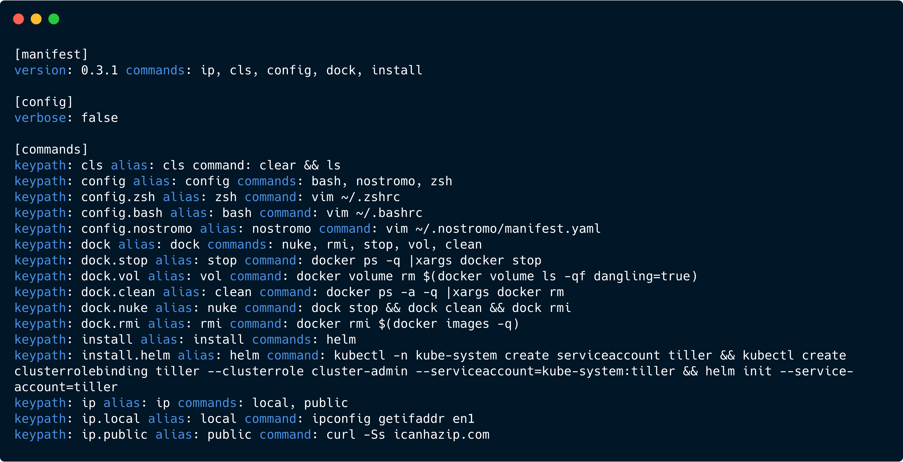

[](https://travis-ci.org/pokanop/nostromo)
[](https://goreportcard.com/report/github.com/pokanop/nostromo)
[](https://coveralls.io/github/pokanop/nostromo)
[](https://github.com/pokanop/nostromo/blob/master/LICENSE)

<p align="center">
  
</p>

# nostromo

nostromo is a CLI to manage aliases through simple commands to add and remove scoped aliases and substitutions.

<p align="center">
  
</p>

Managing aliases can be tedious and difficult to set up. nostromo makes this process easy and reliable. The tool adds shortcuts to your `.bashrc` / `.zshrc` that call into the nostromo binary. It reads and manages all aliases within its manifest. This is used to find and execute the actual command as well as swap any substitutions to simplify calls.

nostromo can help you build complex tools in a declarative way. Tools commonly allow you to run multi-level commands like `git rebase master branch` or `docker rmi b750fe78269d` which seem clear to use. Imagine if you could wrap your aliases / commands / workflow into custom commands that describe things you do often. Well, now you can with nostromo. 🤓

With nostromo you can take aliases like these:
```sh
alias ios-build='pushd $IOS_REPO_PATH;xcodebuild -workspace Foo.xcworkspace -scheme foo_scheme'
alias ios-test='pushd $IOS_REPO_PATH;xcodebuild -workspace Foo.xcworkspace -scheme foo_test_scheme'
alias android-build='pushd $ANDROID_REPO_PATH;./gradlew build'
alias android-test='pushd $ANDROID_REPO_PATH;./gradlew test'
```
and turn them into declarative commands like this:
```sh
build ios
build android
test ios
test android
```
The possibilities are endless and up to your imagination with the ability to compose commands as you see fit.

## Getting Started

### Prerequisites
- Works for MacOS and `bash` / `zsh` shells (other combinations untested _but may work_)

### Installation

Using `brew`:

```sh
brew tap pokanop/pokanop
brew install nostromo
```

Using `go get`:
```sh
go get -u github.com/pokanop/nostromo
```

### Initialization
This command will initialize nostromo and create a manifest under `~/.nostromo`:
```sh
nostromo init
```

To destroy the manifest and start over you can always run:
```sh
nostromo destroy
```

## Key Features
- Simplified alias management
- Scoped commands and substitutions
- Build complex command trees
- Shell completion support
- Preserves flags and arguments
- Execute code snippets

## Usage

### Managing Aliases
Aliases to commands is one of the core features provided by nostromo. Instead of constantly updating shell profiles manually, nostromo will automatically keep it updated with the latest additions.

> Given that nostromo is not a shell command there are some things to note on how it makes its magic:
>
> - *Commands are generated by nostromo and executed using the `eval` method in a shell function.*
> - *Commands and changes will be available immediately since nostromo reloads completions automatically*
>
> If you want create boring standard **shell aliases** you can do that with an additional flag or a config setting described below.

To add an alias (or command in nostromo parlance), simply run:
```sh
nostromo add cmd foo "echo bar"
```
And just like that you can now run `foo` like any other alias.

Descriptions for your commands can easily be added as well:
```sh
nostromo add cmd foo "echo bar" -d "My magical foo command that prints bar"
```

> Your descriptions will show up in the shell when autocompleting!

#### Interactive Mode
You can also add commands and substitutions **interactively** by using just `nostromo add` without any arguments. This command will walk through prompts to guide adding new commands easily.

```sh
❯ nostromo add
Awesome! Let's add a new command or substitution to nostromo.
Follow the prompts below to get started.

A nostromo command is a powerful shell alias that can be used to run one or many scoped commands.
Substitutions are scoped so sub commands all inherit them. You can have nostromo swap arguments on the command
line when it sees them simplifying your workflow.

  1) command
  2) substitution

Choose what you would like to add (command): 1
...
```

#### Keypaths
nostromo uses the concept of keypaths to simplify building commands and accessing the command tree. A keypath is simply a `.` delimited string that represents the path to the command.

For example:
```sh
nostromo add cmd foo.bar.baz 'echo hello'
```
will build the command tree for `foo` 👉 `bar` 👉 `baz` such that any of these commands are now valid (of course the first two do nothing _yet_ 😉):
```sh
foo
foo bar
foo bar baz
```
where the last one will execute the `echo` command.

You can compose several commands together by adding commands at any node of the keypath. The **default** behavior is to concatenate the commands together as you walk the tree. Targeted use of `;` or `&&` can allow for running multiple commands together instead of concatenating. More easily, you can change the command `mode` for any of the commands to do this for you automatically. More info on this later.

#### Shell Aliases

nostromo allows users to manage shell aliases. By default, all commands are designed to execute the nostromo binary and resolve a command to be evaluated in the shell. This allows you to run those declarative commands easily like `foo bar baz` in the shell. nostromo only creates an alias as a shell function for the root command `foo` and passes the remaining arguments to `nostromo eval` to evaluate the command tree. The result of that is executed with `eval` in the shell. Standard shell aliases **do not** get this behavior.

> The use of standard shell aliases provides limited benefit if you only want single tiered aliases. Additionally, nostromo commands persist in the shell since they are evaluated (i.e., changing directories via `cd`).

There are two methods for adding aliases to your shell profile that are considered standard aliases:
- Use the `--alias-only` or `-a` flag when using `nostromo add cmd`
- Set the `aliasesOnly` config setting to affect all command additions

For example, you can see both methods here:
```sh
nostromo add cmd foo.bar.baz "cd /tmp" --alias-only

nostromo manifest set aliasesOnly true
nostromo add cmd foo.bar.baz "cd /tmp"
```
Adding a standard alias will produce this line that gets sourced:
```sh
alias foo.bar.baz='cd /tmp'
```
instead of a nostromo command which adds a shell function:
```sh
foo() { eval $(nostromo eval foo "$*") }
```

> Notice how the keypath has no affect in building a command tree when using the **alias only** feature. Standard shell aliases can only be root level commands.

### Scoped Commands & Substitutions
Scope affects a tree of commands such that a parent scope is prepended first and then each command in the keypath to the root. If a command is run as follows:
```sh
foo bar baz
```
then the command associated with `foo` is concatenated first, then `bar`, and finally `baz`. So if these commands were configured like this:
```sh
nostromo add cmd foo 'echo oof'
nostromo add cmd foo.bar 'rab'
nostromo add cmd foo.bar.baz 'zab'
```
then the actual execution would result in:
```sh
echo oof rab zab
```

#### Substitutions
nostromo also provides the ability to add substitutions at each one of these scopes in the command tree. So if you want to shorten common strings that are otherwise long into substitutions, you can attach them to a parent scope and nostromo will replace them at execution time for all instances.

A substitution can be added with:
```sh
nostromo add sub foo.bar //some/long/string sls
```
Subsequent calls to `foo bar` would replace the subs before running. This command:
```sh
foo bar baz sls
```
would finally result in the following since the substitution is in scope:
```sh
oof rab zab //some/long/string
```

### Complex Command Tree
Given features like **keypaths** and **scope** you can build a complex set of commands and effectively your own tool 🤯 that performs additive functionality with each command node.

You can get a quick snapshot of the command tree using:
```sh
nostromo manifest show
```

With nostromo, you can also visualize the command tree (or manifest) in several other ways including as `json`, `yaml` and a tree itself.
```
nostromo manifest show --tree
manifest ┬─ ard
         ├─ certs ── sync
         ├─ cls
         ├─ config ┬─ nostromo
         │         ├─ zsh
         │         └─ bash
         ├─ dock ┬─ vol
         │       ├─ clean
         │       ├─ nuke
         │       ├─ rmi
         │       └─ stop
         ├─ install ── helm
         └─ ip ┬─ hosts
               ├─ local
               └─ public
```

Setting the `verbose` config item prints more detailed information as well.
```
nostromo manifest set verbose true
nostromo manifest show
...
+--------------+------------------------------------------+
| keypath      | ip.local                                 |
| alias        | local                                    |
| command      | ipconfig getifaddr en1                   |
| description  | Get the local IP address of this machine |
| code         | false                                    |
+--------------+------------------------------------------+

+--------------+-------------------------------------------+
| keypath      | ip.public                                 |
| alias        | public                                    |
| command      | curl -Ss icanhazip.com                    |
| description  | Get the public IP address of this machine |
| code         | false                                     |
+--------------+-------------------------------------------+
...
```

#### Execution Modes
A command's mode indicates how it will be executed. By default, nostromo concatenates parent and child commands along the tree. There are 3 modes available to commands:
```sh
  concatenate  Concatenate this command with subcommands exactly as defined
  independent  Execute this command with subcommands using ';' to separate
  exclusive    Execute this and only this command ignoring parent commands
```

The mode can be set when adding a command with the `-m` or `--mode` flag:
```sh
nostromo add cmd foo.bar.baz -m exclusive "echo baz"
```

A global setting can also be set to automatically change the mode from the default `concatenate` mode using:
```sh
nostromo manifest set mode independent
```
> All subsequent commands would inherit the above mode if set.

### Shell Completion
nostromo provides completion scripts to allow tab completion. This is added by default to your shell init file:
```sh
eval "$(nostromo completion)"
```

Even your commands added by nostromo get the full red carpet treatment with shell completion.
Be sure to add a description and tab completion will show hints at each junction of your command. Cool right! 😎

### Execute Code Snippets
nostromo provides the ability to supply code snippets in the following languages for execution, in lieu of the standard shell command:
- `ruby` - runs ruby interpreter
- `python` - runs python interpreter
- `js` - runs node
- `perl` - runs perl interpreter

```sh
nostromo add cmd foo --code 'console.log("hello js")' --language js
```

For more complex snippets you can edit `~/.nostromo/manifest.yaml` directly but multiline YAML must be escaped correctly to work.

## Credits
- This tool was bootstrapped using [cobra](https://github.com/spf13/cobra).
- Colored logging provided by [aurora](https://github.com/logrusorgru/aurora).
- Nostromo fan art supplied by [Ian Stewart](https://www.artstation.com/artwork/EBBVN).
- Gopher artwork by [@egonelbre](https://github.com/egonelbre/gophers) and original by [Renee French](http://reneefrench.blogspot.com/).

## Contibuting
Contributions are what makes the open-source community such an amazing place to learn, inspire, and create. Any contributions you make are **greatly appreciated**.

1. Fork the Project
2. Create your Feature Branch (`git checkout -b feature/AmazingFeature`)
3. Commit your Changes (`git commit -m 'Add some AmazingFeature'`)
4. Push to the Branch (`git push origin feature/AmazingFeature`)
5. Open a Pull Request

## License
Distributed under the MIT License.
