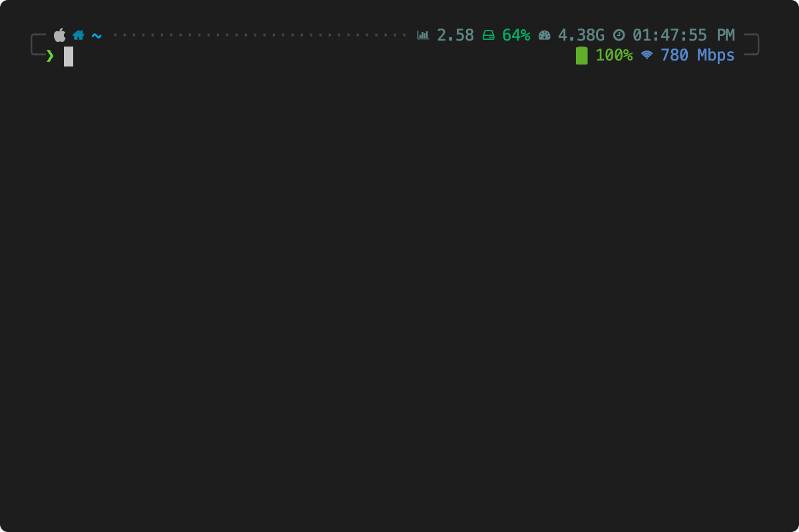
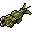
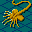

[](https://github.com/pokanop/nostromo/actions/workflows/ci.yml) [](https://goreportcard.com/report/github.com/pokanop/nostromo) [](https://coveralls.io/github/pokanop/nostromo) [](https://github.com/pokanop/nostromo/blob/master/LICENSE) [](https://github.com/avelino/awesome-go)

<p align="center">
  
</p>

<p align="left" style="margin: 12px 0px">
  &nbsp;
  
</p>

`nostromo` is a CLI to rapidly build declarative aliases making multi-dimensional tools on the fly.

<p align="center">
  
</p>

Managing aliases can be tedious and difficult to set up. `nostromo` makes this process easy and reliable. The tool adds shortcuts to your `.bashrc` / `.zshrc` that call into the `nostromo` binary. It reads and manages all aliases within its manifest. This is used to find and execute the actual command as well as swap any substitutions to simplify calls.

`nostromo` can help you build complex tools in a declarative way. Tools commonly allow you to run multi-level commands like `git rebase master branch` or `docker rmi b750fe78269d` which are clear to use. Imagine if you could wrap your aliases / commands / workflow into custom commands that describe things you do often. Well, now you can with nostromo. 🤓

With `nostromo` you can take aliases like these:

```sh
alias ios-build='pushd $IOS_REPO_PATH;xcodebuild -workspace Foo.xcworkspace -scheme foo_scheme'
alias ios-test='pushd $IOS_REPO_PATH;xcodebuild -workspace Foo.xcworkspace -scheme foo_test_scheme'
alias android-build='pushd $ANDROID_REPO_PATH;./gradlew build'
alias android-test='pushd $ANDROID_REPO_PATH;./gradlew test'
```

and turn them into declarative commands like this:

```sh
build ios
build android
test ios
test android
```

The possibilities are endless 🚀 and up to your imagination with the ability to compose commands as you see fit.

> Check out the [examples](https://github.com/pokanop/nostromo/tree/main/examples) folder for sample manifests with commands.

## &nbsp;Getting Started

### Prerequisites

- Works for MacOS and Linux with `bash`, `zsh`, `fish` and PowerShell (`pwsh`) shells
- Windows with PowerShell should work _but is untested_

### Installation

Using `brew`:

```sh
brew install pokanop/pokanop/nostromo
```

Using `go get`:

```sh
go get -u github.com/pokanop/nostromo
```

### Initialization

This command will initialize `nostromo` and create a manifest under `~/.nostromo`:

```sh
nostromo init
```

To customize the directory (and change it from `~/.nostromo`), set the `NOSTROMO_HOME` environment variable to a location of your choosing.

> With every update, it's a good idea to run `nostromo init` to ensure any manifest changes are migrated and commands continue to work. `nostromo` will attempt to perform any migrations as well at this time to files and folders so 🤞

The quickest way to populate your commands database is using the `dock` feature:

```sh
nostromo dock <source>
```

where `source` can be any local or remote file sources. See [Dock, undock and sync](https://nostromo.sh/concepts/distributed-manifests/) for more details.

To destroy the core manifest and start over you can always run:

```sh
nostromo destroy
```

Backups of manifests are automatically taken to prevent data loss in case of shenanigans gone wrong. These are located under `${NOSTROMO_HOME}/cargo`. The maximum number of backups can be configured with the `backupCount` manifest setting.

```sh
nostromo set backupCount 10
```

## &nbsp;Key Features

- **Simplified alias management** — add, remove, rename and update commands with `nostromo add cmd foo.bar "echo hi"`. See [Commands and keypaths](https://nostromo.sh/concepts/commands/).
- **Scoped commands and substitutions** — build trees where parents contribute to children, and swap long arguments for short aliases. See [Substitutions](https://nostromo.sh/concepts/substitutions/).
- **Execution modes** — `concatenate`, `independent` and `exclusive` control how a command tree is joined. See [Execution modes](https://nostromo.sh/concepts/modes/).
- **Shell completion** for `bash`, `zsh`, `fish` and PowerShell, regenerated automatically. See [Shell integration](https://nostromo.sh/getting-started/shell-integration/).
- **Code snippets** — run `python`, `ruby`, `perl` or `js` one-liners as commands. See [Code snippets](https://nostromo.sh/concepts/code-snippets/).
- **Distributed manifests** — `dock`, `sync` and `undock` manifests from Git, HTTP, S3, GCS or local files. See [Dock, undock and sync](https://nostromo.sh/concepts/distributed-manifests/).
- **Tree management** — `move`, `copy`, `rename` and `detach` whole subtrees. See [Tree management](https://nostromo.sh/concepts/tree-management/).
- **Automatic backups** and **neato themes**. See [Backups](https://nostromo.sh/concepts/backups/) and [Configuration and themes](https://nostromo.sh/concepts/configuration/).

## &nbsp;Documentation

Full documentation lives at **[nostromo.sh](https://nostromo.sh)**:

- [Getting started](https://nostromo.sh/getting-started/) — installation, `nostromo init`, shell integration
- [Concepts](https://nostromo.sh/concepts/) — manifests, the spaceport, keypaths, substitutions, modes and more
- [Command reference](https://nostromo.sh/reference/nostromo/) — generated from the CLI itself
- [Manifest YAML schema](https://nostromo.sh/schema/)
- [Examples](https://nostromo.sh/examples/) — walkthroughs of the manifests in [`examples/`](examples)
- [FAQ and troubleshooting](https://nostromo.sh/faq/)

The site is built with MkDocs from the [`docs/`](docs) folder; see [Contributing](https://nostromo.sh/contributing/) for how to work on it.

## &nbsp;Credits

- This tool was bootstrapped using [cobra](https://github.com/spf13/cobra).
- Colored logging provided by [aurora](https://github.com/logrusorgru/aurora/v3).
- Fan art supplied by [Ian Stewart](https://www.artstation.com/artwork/EBBVN).
- Gopher artwork by [@egonelbre](https://github.com/egonelbre/gophers) and original by [Renee French](http://reneefrench.blogspot.com/).
- File downloader using [go-getter](https://github.com/hashicorp/go-getter)

## &nbsp;Contributing

Contributions are what makes the open-source community such an amazing place to learn, inspire, and create. Any contributions you make are **greatly appreciated**.

1. Fork the Project
2. Create your Feature Branch (`git checkout -b feature/AmazingFeature`)
3. Commit your Changes (`git commit -m 'Add some AmazingFeature'`)
4. Push to the Branch (`git push origin feature/AmazingFeature`)
5. Open a Pull Request

## &nbsp;License

Distributed under the MIT License.

## If You ♥️ What We Do

<a href="https://github.com/sponsors/pokanop" target="_blank"></a>
<a href="https://ko-fi.com/pokanop" target="_blank"></a>
<a href="https://www.buymeacoffee.com/pokanopapps" target="_blank"></a>
