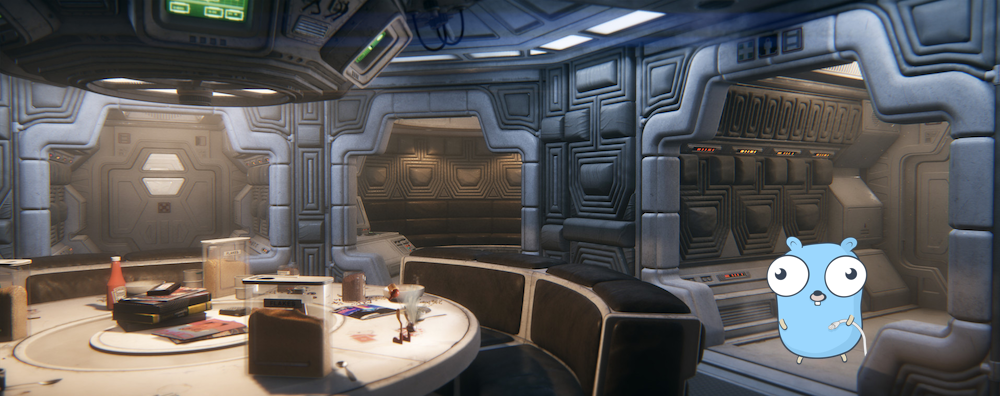

<p align="center">
  
</p>

<p align="left" style="margin: 12px 0px">
  &nbsp;
  
</p>

# nostromo

`nostromo` is a CLI to rapidly build declarative aliases making multi-dimensional tools on the fly.

<p align="center">
  
</p>

Managing aliases can be tedious and difficult to set up. `nostromo` makes this process easy and reliable. The tool adds shortcuts to your shell startup file (`.bashrc`, `.zshrc`, `config.fish` or your PowerShell profile) that call into the `nostromo` binary. It reads and manages all aliases within its **manifest**, which is used to find and execute the actual command as well as swap any **substitutions** to simplify calls.

`nostromo` can help you build complex tools in a declarative way. Tools commonly allow you to run multi-level commands like `git rebase master branch` or `docker rmi b750fe78269d` which are clear to use. Imagine if you could wrap your aliases / commands / workflow into custom commands that describe things you do often. Well, now you can with `nostromo`. :nerd:

With `nostromo` you can take aliases like these:

```sh
alias ios-build='pushd $IOS_REPO_PATH;xcodebuild -workspace Foo.xcworkspace -scheme foo_scheme'
alias ios-test='pushd $IOS_REPO_PATH;xcodebuild -workspace Foo.xcworkspace -scheme foo_test_scheme'
alias android-build='pushd $ANDROID_REPO_PATH;./gradlew build'
alias android-test='pushd $ANDROID_REPO_PATH;./gradlew test'
```

and turn them into declarative commands like this:

```sh
build ios
build android
test ios
test android
```

The possibilities are endless :rocket: and up to your imagination with the ability to compose commands as you see fit.

## Where to go next

<div class="grid cards" markdown>

-   **Getting started**

    ---

    Install `nostromo`, run `nostromo init` and wire it into bash, zsh, fish or PowerShell.

    [:octicons-arrow-right-24: Getting started](getting-started/index.md)

-   **Concepts**

    ---

    Manifests, the spaceport, keypaths, substitutions, execution modes, code snippets, docking and backups.

    [:octicons-arrow-right-24: Concepts](concepts/index.md)

-   **Command reference**

    ---

    Every `nostromo` command and flag, generated straight from the CLI.

    [:octicons-arrow-right-24: Command reference](reference/nostromo.md)

-   **Examples**

    ---

    Ready to dock manifests from the `examples/` folder to get you going quickly.

    [:octicons-arrow-right-24: Examples](examples.md)

</div>

## Key features

- **Simplified alias management** — add, update, move, copy, rename and remove commands without touching your shell profile by hand. See [Commands and keypaths](concepts/commands.md).
- **Scoped commands and substitutions** — build trees of commands where parents contribute to children, and swap long arguments for short aliases. See [Substitutions](concepts/substitutions.md).
- **Execution modes** — `concatenate`, `independent` or `exclusive` control how a command tree is turned into a shell command. See [Execution modes](concepts/modes.md).
- **Shell completion** — tab completion for `nostromo` *and* for the commands you add, in bash, zsh, fish and PowerShell. See [Shell integration](getting-started/shell-integration.md).
- **Code snippets** — run `ruby`, `python`, `perl` or `js` one-liners in place of a shell command. See [Code snippets](concepts/code-snippets.md).
- **Distributed manifests** — dock manifests from local files, Git, Mercurial, HTTP, S3 or GCS and keep them in sync. See [Dock, undock and sync](concepts/distributed-manifests.md).
- **Backups** — every change is backed up to the `cargo` folder. See [Backups](concepts/backups.md).
- **Themes** — `default`, `grayscale` and `emoji`. See [Configuration and themes](concepts/configuration.md).

## Credits

- This tool was bootstrapped using [cobra](https://github.com/spf13/cobra).
- Colored logging provided by [aurora](https://github.com/logrusorgru/aurora).
- Fan art supplied by [Ian Stewart](https://www.artstation.com/artwork/EBBVN).
- Gopher artwork by [@egonelbre](https://github.com/egonelbre/gophers) and original by [Renee French](http://reneefrench.blogspot.com/).
- File downloader using [go-getter](https://github.com/hashicorp/go-getter).

## License

Distributed under the [MIT License](https://github.com/pokanop/nostromo/blob/main/LICENSE).

## Support the project :heart:

<a href="https://github.com/sponsors/pokanop" target="_blank"></a>
<a href="https://ko-fi.com/pokanop" target="_blank"></a>
<a href="https://www.buymeacoffee.com/pokanopapps" target="_blank"></a>
